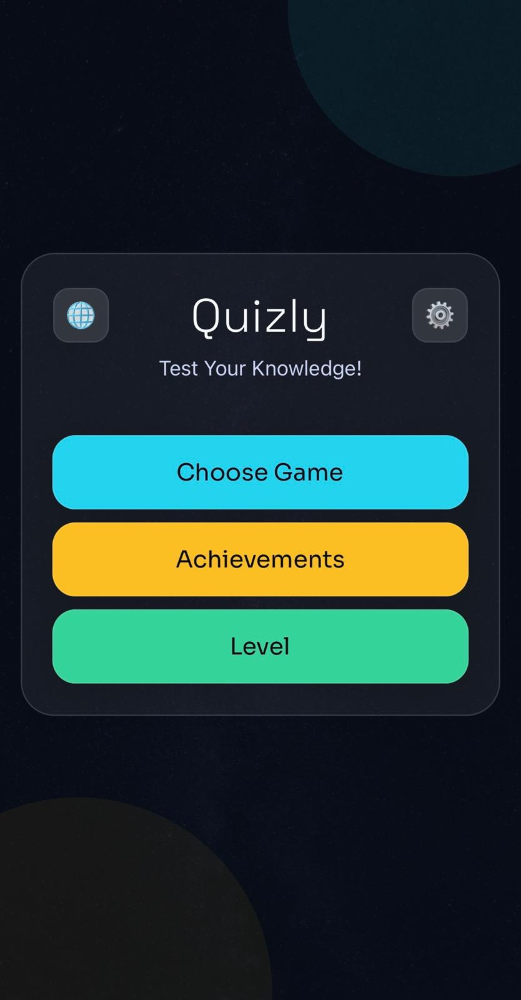
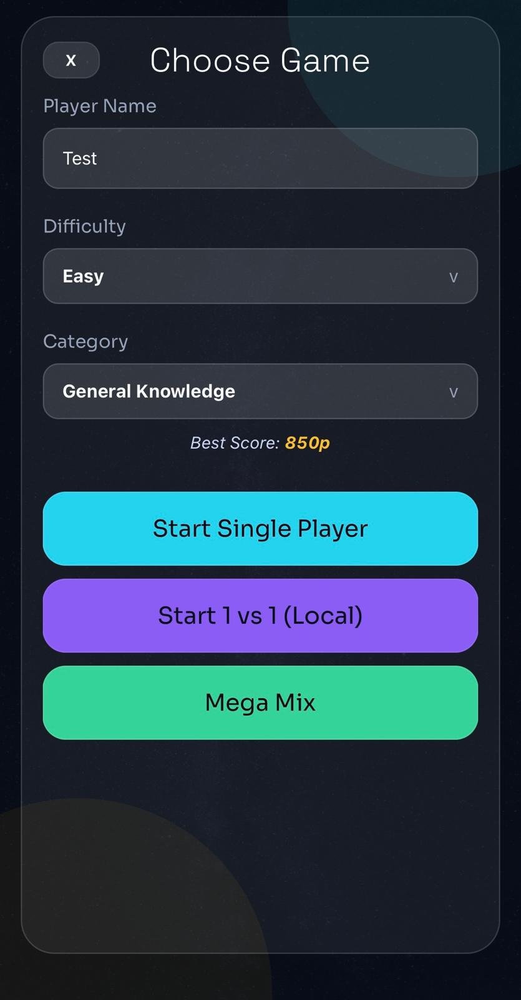
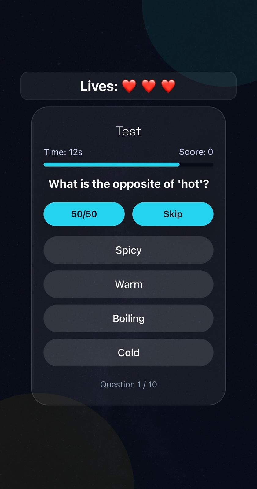
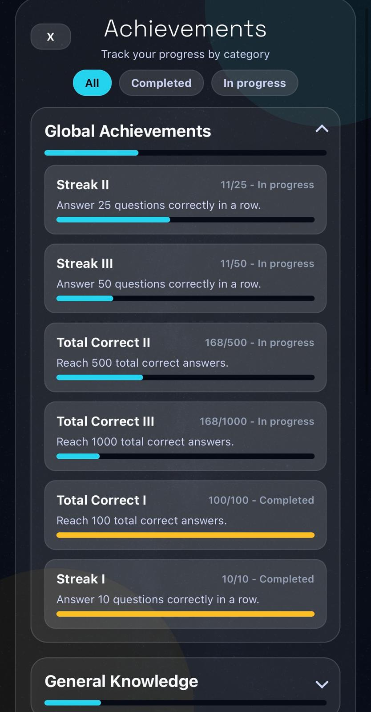
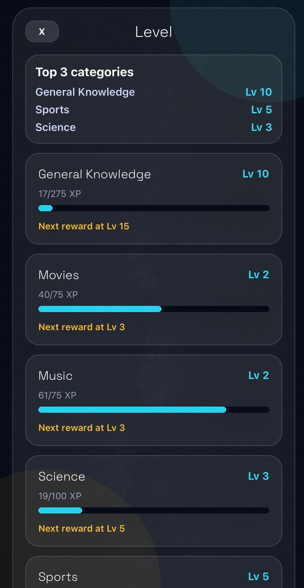

# Quizly Game

O aplicație mobilă de quiz de cultură generală, construită cu React Native și Expo. Testează-ți cunoștințele în 7 categorii, urmărește-ți progresul cu XP și realizări, și provoacă-ți prietenii în modul 1v1 local.

## Funcționalități

- **7 Categorii** — General Knowledge, Movies, Music, Science, Sports, Geography, Mathematics
- **3 Nivele de dificultate** — Easy, Medium, Hard (cu multiplicatori de XP)
- **Category Mastery** — Sistem de progresie XP cu 50 de nivele per categorie și recompense la milestone-uri
- **Realizări (Achievements)** — Streak I/II/III, Total Correct I/II/III cu tracking persistent
- **Power-ups** — 50/50 (elimină două răspunsuri greșite) și Skip
- **Mod 1v1 Local** — Doi jucători concurează pe același dispozitiv
- **Mega Mix** — Întrebări din toate categoriile amestecate
- **Bilingv** — Suport complet în română și engleză (interfață + întrebări)
- **Offline** — Funcționează complet fără internet

## Stiva Tehnologică

- **React Native 0.81.5** + **Expo SDK 54**
- **AsyncStorage** pentru persistarea locală a datelor
- **React Native Reanimated** pentru animații fluide
- **Expo AV** / **Expo Haptics** pentru sunet și feedback tactil
- **Expo Router** pentru navigare

## Capturi de Ecran

<p align="center">
  
  
  
  
  
</p>

## Pornire Rapidă

```bash
# Clonează repository-ul
git clone https://github.com/your-username/quizly-mobile.git
cd quizly-mobile

# Instalează dependințele
npm install

# Pornește serverul de dezvoltare
npx expo start
```

Scanează codul QR cu **Expo Go** (Android/iOS) pentru a rula pe dispozitiv.

## Structura Proiectului

```
quizly-mobile/
├── app/index.js              # Punctul de intrare
├── components/               # Ecranele UI
│   ├── StartScreen.js
│   ├── GameSelectScreen.js
│   ├── QuizScreen.js
│   ├── ResultScreen.js
│   ├── VersusScreen.js
│   ├── AchievementsScreen.js
│   └── CategoryMasteryScreen.js
├── utils/                    # Logica de business
│   ├── achievements.js
│   ├── masteryService.js
│   ├── i18n.js
│   ├── highscores.js
│   ├── storageService.js
│   └── theme.js
├── data.js                   # Întrebări (EN)
├── data-ro.js                # Întrebări (RO)
└── assets/                   # Fonturi, imagini, sunete
```

## Build

```bash
# Build APK pentru Android
eas build --platform android --profile production
```
